# Event Storming — Flujo de Reserva de Esterilización

## Leyenda de elementos

| Color / Forma | Tipo | Descripción |
|---------------|------|-------------|
| 🟦 Azul | **Command** | Acción que el sistema o usuario inicia |
| 🟧 Naranja | **Event** | Hecho que ya ocurrió (pasado) |
| 🟪 Púrpura | **Policy / Rule** | Regla de negocio que decide el flujo |
| 🟨 Amarillo | **Aggregate / Data** | Entidad o almacén de datos |
| 🟩 Verde claro | **Read Model** | Vista de datos para el usuario |
| 🟫 Rosa | **External System** | Sistema externo al dominio |

## Diagrama Mermaid — Flujo completo

```mermaid
graph TD
    Start((Inicio)) --> CMD_Ident[Identificar Usuario / Intent]
    CMD_Ident --> EVT_UserIdent[Usuario Identificado]
    EVT_UserIdent --> POL_CheckPets{Comprobar num mascotas}

    POL_CheckPets -- "Mas de 1" --> EVT_Call[Derivar a llamada telefonica]
    EVT_Call --> EndCall((Fin))

    POL_CheckPets -- "1 mascota" --> CMD_AskNew[Preguntar: es mascota nueva?]
    CMD_AskNew --> EVT_NewPetStatus[Estado mascota recibido]

    EVT_NewPetStatus --> CMD_AskDetails[Preguntar Especie, Sexo, Peso]
    CMD_AskDetails --> EVT_DetailsReceived[Datos recibidos]
    EVT_DetailsReceived --> POL_Species{Especie?}

    POL_Species -- "Gato" --> CMD_AskHeat_Cat[Info: Gatos pueden operarse en celo]
    CMD_AskHeat_Cat --> EVT_CatInfo[Info gato completa]
    EVT_CatInfo --> POL_CalcTime_Cat["Calcular tiempo: Macho 12m, Hembra 15m"]

    POL_Species -- "Perro" --> CMD_AskHeat_Dog[Preguntar: esta en celo?]
    CMD_AskHeat_Dog --> POL_CheckHeat_Dog{En celo?}
    POL_CheckHeat_Dog -- "Si" --> EVT_RejectHeat[Rechazar: esperar 2 meses]
    EVT_RejectHeat --> EndHeat((Fin))
    POL_CheckHeat_Dog -- "No" --> POL_CalcTime_Dog["Calcular tiempo: Macho 30m, Hembra 45-70m segun peso"]

    POL_CalcTime_Cat --> CMD_CheckAvail[Comprobar disponibilidad]
    POL_CalcTime_Dog --> CMD_CheckAvail

    subgraph Tetris["Algoritmo Tetris"]
        CMD_CheckAvail --> AGG_Agenda[Agenda Aggregate]
        AGG_Agenda --> POL_Rule1{"Regla 1: Total minutos dia <= 240?"}
        POL_Rule1 -- "Si" --> POL_Rule2{"Regla 2: Si perro, total perros dia <= 2?"}
        POL_Rule1 -- "No" --> EVT_NoSlot[Slot no disponible]
        POL_Rule2 -- "No" --> EVT_NoSlot
        POL_Rule2 -- "Si" --> EVT_SlotFound[Slots validos encontrados]
    end

    EVT_NoSlot --> CMD_NextDay[Comprobar siguiente dia]
    CMD_NextDay --> AGG_Agenda
    EVT_SlotFound --> CMD_ShowDates[Mostrar fechas disponibles]
    CMD_ShowDates --> EVT_DatesShown[Fechas mostradas]
    EVT_DatesShown --> CMD_SelectDate[Usuario selecciona fecha]
    CMD_SelectDate --> EVT_DateSelected[Fecha seleccionada]

    EVT_DateSelected --> CMD_AskExtras[Preguntar: microchip / rabia?]
    CMD_AskExtras --> EVT_ExtrasRecorded[Extras registrados]
    EVT_ExtrasRecorded --> POL_AssignWindow{Asignar ventana entrega}

    POL_AssignWindow -- "Gato" --> READ_WindowCat["Ventana: 08:00 - 09:00"]
    POL_AssignWindow -- "Perro" --> READ_WindowDog["Ventana: 09:00 - 10:30"]

    READ_WindowCat --> CMD_FinalConfirm[Confirmar cita]
    READ_WindowDog --> CMD_FinalConfirm
    CMD_FinalConfirm --> EVT_ApptBooked[Cita reservada]
    EVT_ApptBooked --> CMD_SendInstructions[Enviar instrucciones ayuno y consentimiento]
    CMD_SendInstructions --> EndSuccess((Fin))
```

## Resumen numerado del flujo

1. **Identificación de usuario e intent** — El chatbot detecta que el usuario quiere agendar esterilización.
2. **Comprobación de mascotas** — Si tiene más de una mascota → derivar a llamada telefónica.
3. **Onboarding de mascota** — Recoger especie (gato/perro), sexo y peso.
4. **Rama gato** — Los gatos pueden operarse en celo. Calcular tiempo (macho 12 min, hembra 15 min).
5. **Rama perro** — Comprobar celo: si está en celo → rechazar (esperar 2 meses). Si no → calcular tiempo según peso (macho 30 min, hembra 45–70 min).
6. **The Tetris** — Comprobar disponibilidad en la agenda: límite diario ≤240 min Y si es perro, máx 2 perros/día. Si no hay hueco → probar siguiente día operativo.
7. **Selección de fecha** — Mostrar fechas disponibles, usuario elige.
8. **Extras** — Preguntar por microchip y/o vacuna de rabia (opcionales).
9. **Ventana de entrega** — Asignar según especie: gatos 08:00–09:00, perros 09:00–10:30.
10. **Confirmación** — Confirmar cita y enviar instrucciones de ayuno + consentimiento informado.
